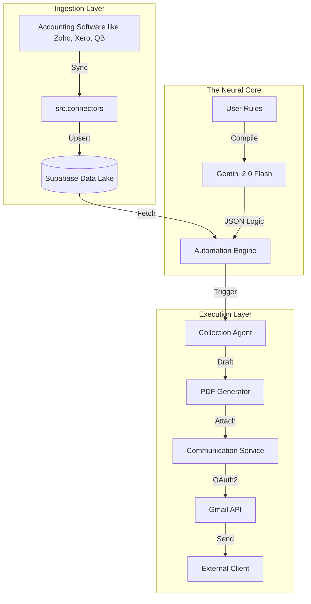

# Fulcrum - The AI Accountant for SMBs 🚀

Fulcrum is an autonomous finance agent designed to help Small and Medium Businesses (SMBs) close their monthly books with the speed and accuracy of an in-house finance hire. It acts as a proactive financial partner—chasing unpaid invoices, preparing monthly reports, and flagging critical issues before they worsen.

## 🔒 Private Backend Repository
**The backend repository is private.**
This codebase contains proprietary AI logic, automation engines, and integration services. Access to the backend source code is restricted. If you are an investor, partner, or developer interested in the backend architecture, please request access by contacting:

📧 **nomaanuddinfaruki@gmail.com**

---

## 🌟 Core Mission

Most SMBs struggle with manual bookkeeping, late payments, and delayed reporting. Fulcrum solves this by automating the "busy work" of finance. 

**It doesn't just track numbers; it acts on them.**

## ✨ Key Features

### 1. 🤖 Autonomous Collections (Autopilot)
* **Smart Chasing:** Define natural language rules (e.g., *"Chase invoices > 1000 EUR that are 3 days late"*), and Fulcrum will automatically identify targets.
* **Professional Outreach:** Generates polished email drafts with **branded PDF invoice attachments** automatically attached.
* **Gmail Integration:** Connects securely via OAuth2 to send emails directly from your business address—no "no-reply" bots.

### 2. 📊 Instant Financial Reporting
* **One-Click Close:** Generate Monthly P&L statements and Executive Summaries instantly.
* **AI Insights:** Provides an AI-generated narrative of your financial health, highlighting revenue trends, expense anomalies, and net income.
* **PDF Exports:** Download professional, board-ready PDF reports on demand.

### 3. 💬 "Ask Fulcrum" (AI Finance Assistant)
* **Natural Language Querying:** Chat with your finance data like you would with a CFO.
    * *"What is my runway?"*
    * *"Who are my top 3 overdue customers?"*
    * *"Compare last month's travel expenses to this month."*

### 4. 🔗 Seamless Integrations
* **Zoho Books:** Two-way sync for real-time invoice and transaction data.
* **Gmail:** Secure, token-based authentication (OAuth2) for email delivery.
* **Supabase:** Enterprise-grade database with Row Level Security (RLS).

---

## 🛠️ Tech Stack

### **Backend (Python & FastAPI)**
* **Framework:** FastAPI (High-performance async API)
* **AI Engine:** Google Gemini (1.5 Pro/Flash, 2.0 Flash) for reasoning and content generation.
* **Database:** Supabase (PostgreSQL) for structured financial data.
* **Auth:** Google OAuth2 & Supabase Auth.
* **PDF Engine:** `fpdf` for dynamic, professional document generation.

### **Frontend (Next.js)**
* **Framework:** Next.js 14 (App Router).
* **Styling:** Tailwind CSS & Lucide React Icons.
* **Hosting:** Vercel (Frontend) & Render (Backend).

---

---

## 📄 License
**All Rights Reserved.**
Unauthorized copying, modification, distribution, or use of this software is strictly prohibited without express written permission.
